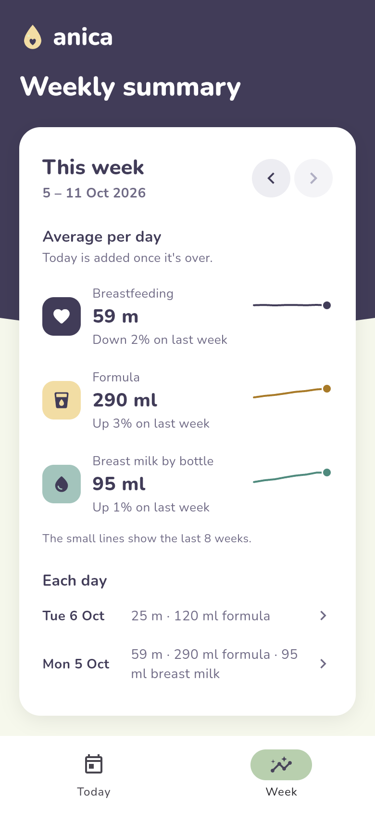
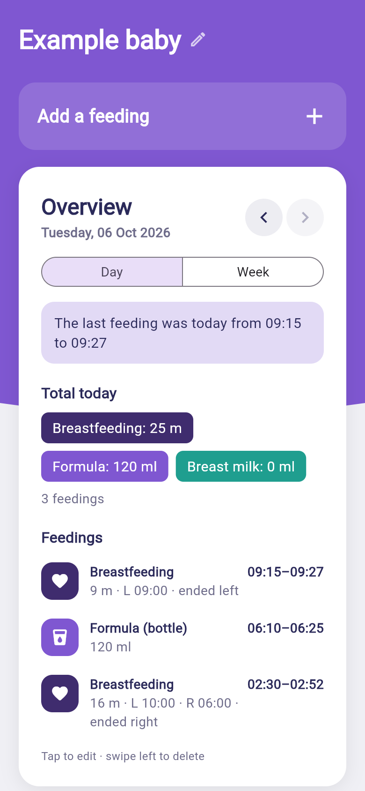
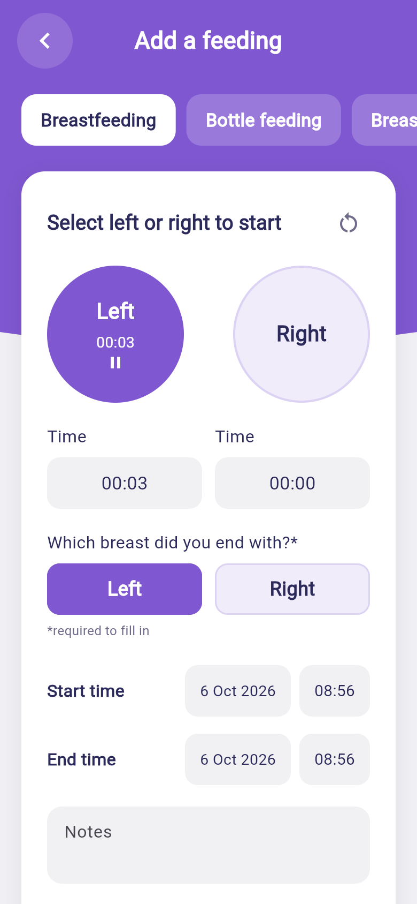
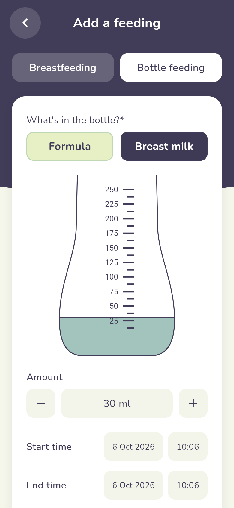

<p align="center"></p>

# Oh baby baby!

A simple Flutter app for logging a baby's feedings and seeing daily and weekly summaries.

## Features

- **Two ways to log a feeding**
  - **Breastfeeding**: tap the Left/Right circles to start, pause or switch the side timers. You can also type each side's time. Choose which breast you ended with (required).
  - **Bottle feeding**: choose what's in the bottle (**formula** or expressed **breast milk**), then set the amount with the bottle gauge (tap or drag it), the −/+ buttons (10 ml steps), or by typing.
  - Every entry has a start and end date/time and optional notes.
- **Two tabs**
  - **Today** (landing page): *Add a feeding*, the time of the last feeding, today's totals and the list of feedings. Arrows step back through earlier days. Tap a feeding to edit it, swipe left to delete it (with undo).
  - **Week**: the average per day for breastfeeding, formula and breast milk by bottle, the change on last week, and a small line showing the last 8 weeks. Below that is a list of the days; tap one to open it on the Today tab. Current-week averages count finished days only.
- The baby's name can be edited by tapping it.
- Data is stored on the device with `shared_preferences`.

## Brand

- **Palette**: `#413C58` indigo · `#A3C4BC` sage · `#BFD7B5` mint · `#E7EFC5` cream · `#F2DDA4` sand. Breastfeeding is indigo, formula is sand and breast milk is sage. Thin chart lines use deeper steps of sand and sage so they stay visible on white.
- **Logo**: a sleepy baby face with a curl of hair and a little "oh" mouth, in `assets/branding/` (SVG and PNG). App icons are generated from `ohbaby_app_icon.png` with `dart run flutter_launcher_icons`.
- **Name**: "Oh baby baby!" in the app; "Oh baby!" under the home-screen icon, where longer names get cut off.
- **Typeface**: [Nunito](https://github.com/googlefonts/nunito), bundled under the SIL Open Font License (`assets/fonts/OFL.txt`).

## Run

```bash
flutter pub get
flutter run
```

## Test

```bash
flutter analyze
flutter test
```

## Structure

```
lib/
  main.dart                    app entry
  theme.dart                   colours and theme
  models/feeding.dart          Feeding model + JSON
  models/summary.dart          daily/weekly totals and formatting
  data/feeding_store.dart      in-memory store persisted to shared_preferences
  screens/main_shell.dart      bottom tabs (Today, Week)
  screens/today_screen.dart    landing page: add a feeding + day overview
  screens/week_screen.dart     weekly summary
  screens/add_feeding_screen.dart  add/edit a feeding
  widgets/                     logo, bottle gauge, shared UI
```

## Screenshots

| Week | Today | Breastfeeding | Bottle |
|---|---|---|---|
|  |  |  |  |
